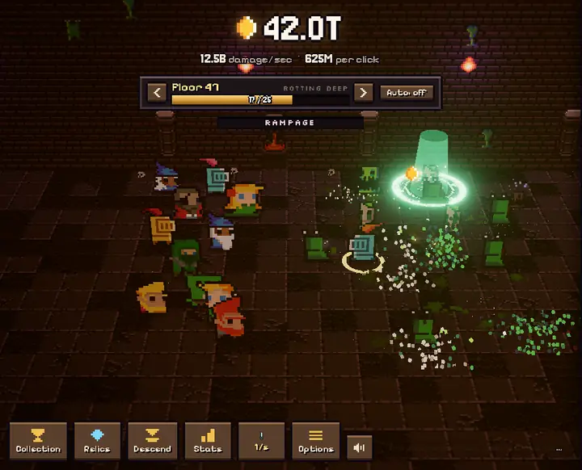

# Deepheart


Fight monsters, hire companions with their gold, and descend the dungeon for souls.
**Play it at https://jamesurobertson.github.io/deepheart/**, or
**[download the desktop app](https://github.com/jamesurobertson/deepheart/releases/latest)** for Mac, Windows or Linux.


## Every monster has a card



One card for every monster in the dungeon, and a ten-thousand-to-one chance of seeing it drop. Cards spin out of the
monster face-down and land face-up; pick one up and it flips over in a burst of light, straight into your collection.
Champions drop gold copies. Boss cards are rarer. The gold card of a champion boss, which only turns up on boss floors
you've already beaten, is the rarest thing in the dungeon. They do nothing except prove you were there.

## What's down there

- **A party that fights for you.** Hire companions with the gold they earn, level them into the thousands, and pick a
  hero to lead around the room with your mouse (or a finger).
- **Relics** from bosses: sixteen of them, each answering a boss modifier or pushing a build.
- **Descend** for souls, **awaken the Heart** for heartstones: two prestige layers, and every run back down is faster
  than the last.
- **Treasure goblins** that run for the exit with your loot. Every so often one is a rainbow. Catch it and find out.
- **No bottom.** After floor 80 the zones come back corrupted, then abyssal, hollow, eternal, and the numbers keep
  climbing past 1e308.

## Getting Started

1. Clone the repository
2. Install dependencies with `npm install`
3. Run the development server with `npm run dev`

Add `?slot=name` to the URL to keep a separate save. On the dev server only: `?speed=10` runs the game faster,
`?cards=often` makes cards drop hundreds of times as often (and champion bosses common), and `?relics=always` makes
every boss drop a relic.

## Development

The project is built with:

- three.js
- TypeScript
- Vite
- break_infinity.js (gold, damage and costs go far past 1e308)

`node scripts/balance.ts 8 5 30 0.3` runs a headless pacing sim (hours, clicks/sec, active minutes, descend ratio).
`npm run pace` simulates active, casual and idle players for 8 hours and fails if the game goes quiet for too long, the first descent pays too little, or replaying a run isn't clearly faster.
`node scripts/build-atlas.ts` repacks the sprite atlas after adding art.
`node scripts/card-sound.ts` regenerates the card drop sounds.

## Desktop app

`desktop/` wraps the built game in Electron. `cd desktop && npm install`, then `npm start` to run it or
`npm run dist:mac` (or `dist:win`, `dist:linux`) to package it into `desktop/release/`.
Pushing a version tag (`git tag v0.2.0 && git push origin v0.2.0`) builds all three on GitHub and publishes them as a
release (`.github/workflows/desktop.yml`).

## Building for Production

To build the project for production:

```bash
npm run build
```

The built files will be in the `dist` directory.

## Deploying

Every push to `main` builds the game and publishes it to GitHub Pages at
https://jamesurobertson.github.io/deepheart/ (`.github/workflows/deploy.yml`).

## Credits

All CC0. Art: [0x72 DungeonTileset II](https://0x72.itch.io/dungeontileset-ii),
[Enchanted Forest Characters](https://superdark.itch.io/enchanted-forest-characters) by Superdark,
[jungle & desert tiles](https://omniboy.itch.io/custom-dungeon-16x16-tileset) by Omniboy,
[Dark Dungeon](https://kosinaz.itch.io/16x16-dark-dungeon-tileset) by Zoltan Kosina,
[DungeonTileset II Extended](https://nijikokun.itch.io/dungeontileset-ii-extended) by Niji,
[CR+ TileSet](https://anritool.itch.io/cr-tileset) characters by AnriTool,
[Pixel Art Spells](https://opengameart.org/content/pixel-art-spells) by DevWizard.
Sound: [Kenney](https://kenney.nl) sound packs. Music: Juhani Junkala's
[Chiptune Adventures](https://opengameart.org/content/4-chiptunes-adventure) and
[5 Chiptunes (Action)](https://opengameart.org/node/55580), [Spooky Dungeon](https://opengameart.org/content/spooky-dungeon) by Memoraphile,
[Desert Theme](https://opengameart.org/node/124080) by Wolfgang_, [Void Estate](https://opengameart.org/content/haunting-chiptune-loop-void-estate) by Zane Little,
[Dark Forest Waltz](https://opengameart.org/content/10-track-modern-chiptune-demo) by The Art Bros and [Fields of Ice](https://opengameart.org/content/fields-of-ice) by Jonathan So. The Goblin Vault theme is generated by `scripts/vault-music.ts`.
