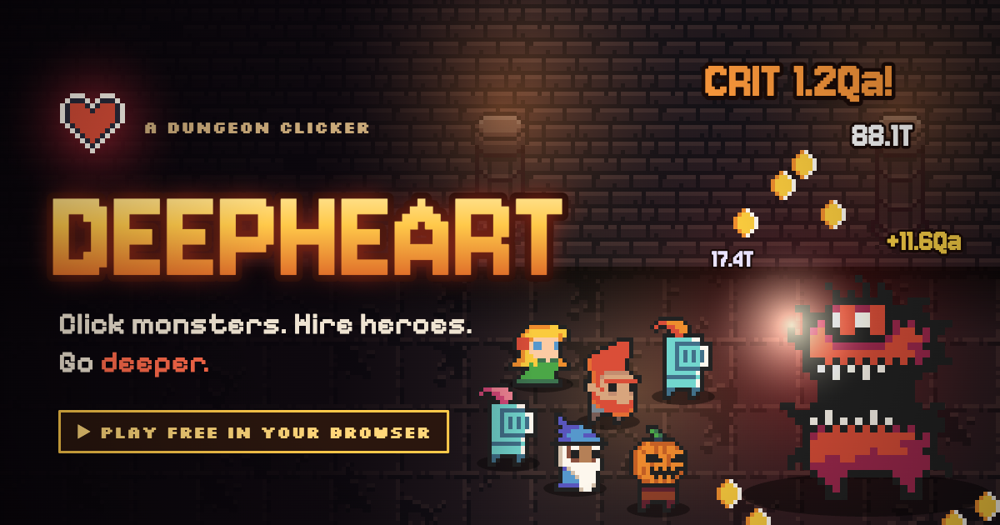
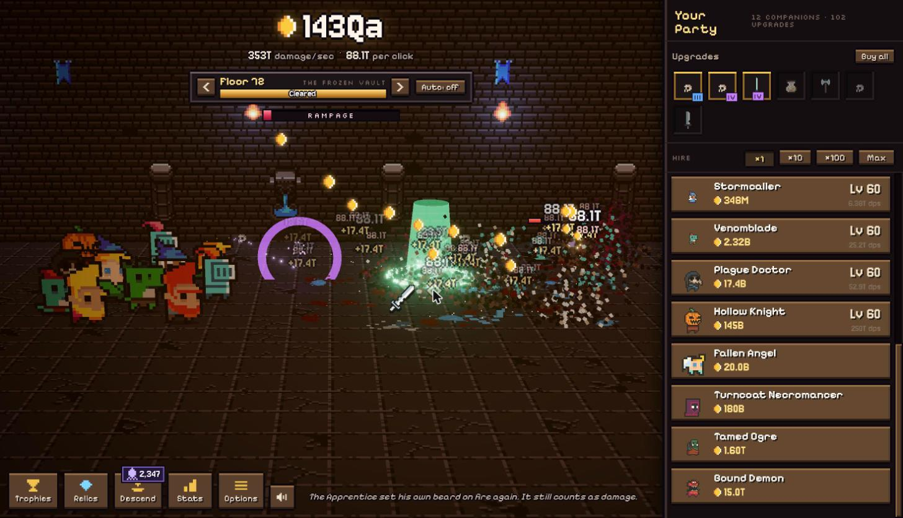

# Deepheart



Click monsters to pieces, hire companions with their gold, and descend the dungeon for souls.
**Play it at https://jamesurobertson.github.io/deepheart/**



## Getting Started

1. Clone the repository
2. Install dependencies with `npm install`
3. Run the development server with `npm run dev`

Add `?slot=name` to the URL to keep a separate save, or `?speed=10` to run the game faster.

## Development

The project is built with:

- three.js
- TypeScript
- Vite

`node scripts/balance.ts 8 5 30 0.3` runs a headless pacing sim (hours, clicks/sec, active minutes, descend ratio).
`node scripts/build-atlas.ts` repacks the sprite atlas after adding art.

## Building for Production

To build the project for production:

```bash
npm run build
```

The built files will be in the `dist` directory.

## Deploying

Every push to `main` builds the game and publishes it to GitHub Pages at
https://jamesurobertson.github.io/deepheart/ (`.github/workflows/deploy.yml`).

## Credits

All CC0. Art: [0x72 DungeonTileset II](https://0x72.itch.io/dungeontileset-ii),
[Enchanted Forest Characters](https://superdark.itch.io/enchanted-forest-characters) by Superdark,
[jungle & desert tiles](https://omniboy.itch.io/custom-dungeon-16x16-tileset) by Omniboy,
[Dark Dungeon](https://kosinaz.itch.io/16x16-dark-dungeon-tileset) by Zoltan Kosina,
[DungeonTileset II Extended](https://nijikokun.itch.io/dungeontileset-ii-extended) by Niji.
Sound: [Kenney](https://kenney.nl) sound packs. Music: Juhani Junkala's
[Chiptune Adventures](https://opengameart.org/content/4-chiptunes-adventure) and
[5 Chiptunes (Action)](https://opengameart.org/node/55580), [Spooky Dungeon](https://opengameart.org/content/spooky-dungeon) by Memoraphile,
[Desert Theme](https://opengameart.org/node/124080) by Wolfgang_, [Void Estate](https://opengameart.org/content/haunting-chiptune-loop-void-estate) by Zane Little,
[Dark Forest Waltz](https://opengameart.org/content/10-track-modern-chiptune-demo) by The Art Bros and [Fields of Ice](https://opengameart.org/content/fields-of-ice) by Jonathan So.
