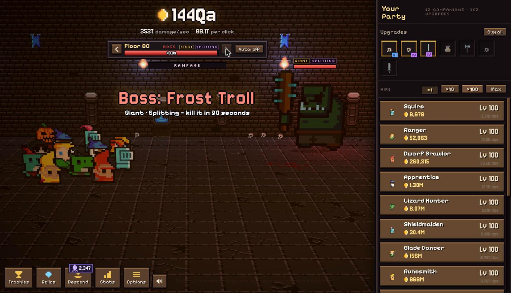
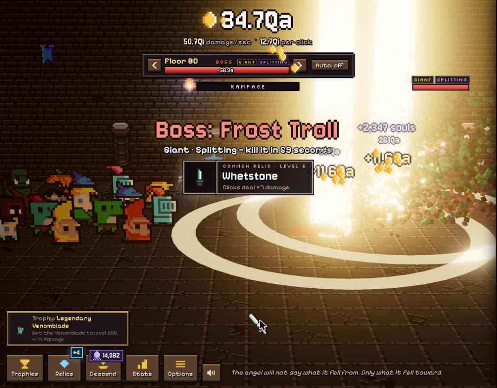
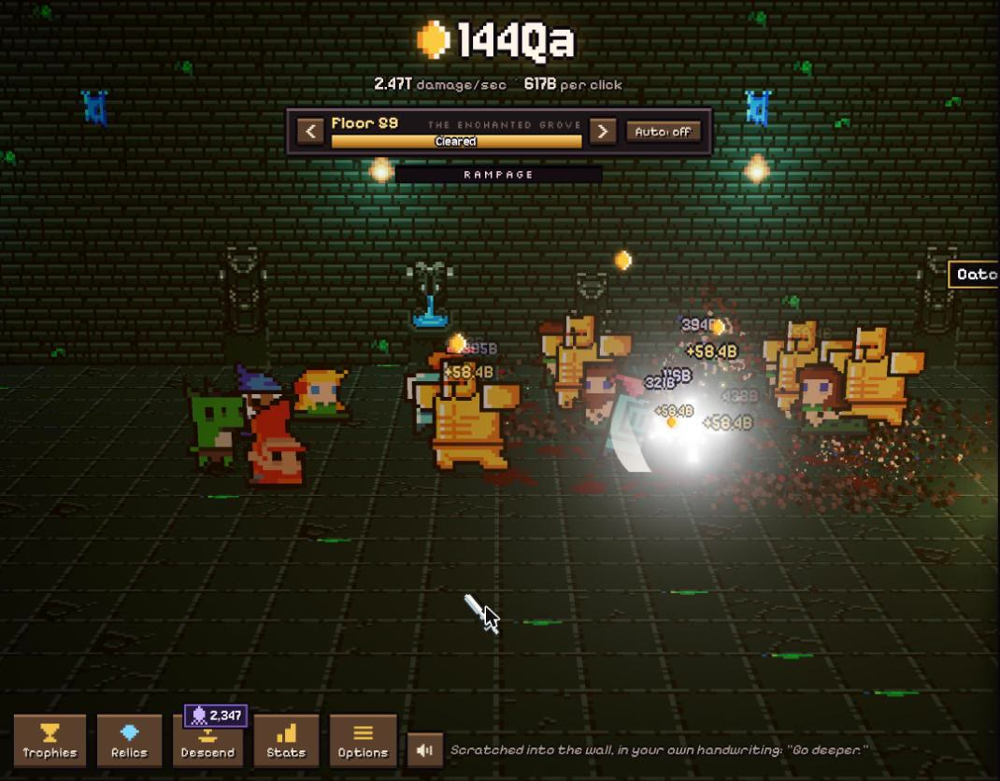
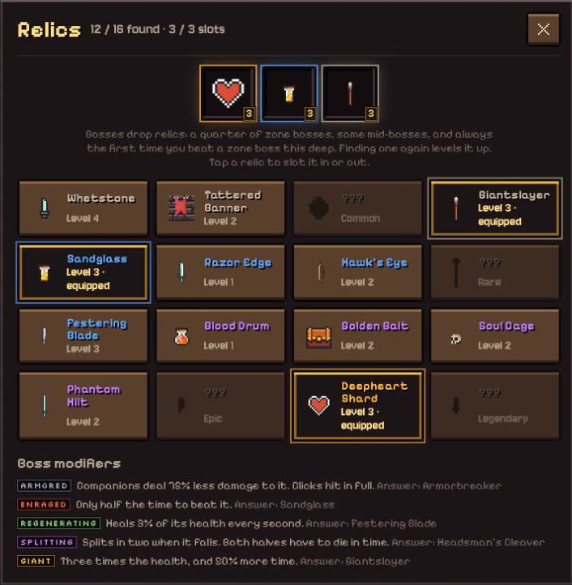

<h1 align="center">💀 Deepheart 💀</h1>

<p align="center">
  <b>Monsters come up the stairs. You click them to pieces. The stairs go down. They always go down.</b>
</p>

<p align="center">
  <a href="https://jamesurobertson.github.io/deepheart/"><b>▶ Play it in your browser</b></a>
</p>

<p align="center">
  
</p>

Deepheart is a clicker set in a pixel-art dungeon, rendered in three.js with lighting, bloom and a lot of blood. You click monsters to kill them. Their gold hires companions who kill monsters for you. Then the numbers get silly: millions, then quadrillions, then units you've never heard of.

Clear floors, beat the boss on every fifth floor, then descend for souls and do it again, deeper. Somewhere below floor 120 the Heart wakes up.

---

## 🗡️ What you'll be doing

<table>
<tr>
<td width="50%"></td>
<td width="50%"></td>
</tr>
<tr>
<td align="center"><b>Bosses are walls.</b> This Frost Troll is <i>Giant</i> (3× health) and <i>Splitting</i> (cut it down and you get two).</td>
<td align="center"><b>...until they aren't.</b> A pillar of light, a shockwave, a relic, a pile of souls. This is the dopamine.</td>
</tr>
<tr>
<td width="50%"></td>
<td width="50%"></td>
</tr>
<tr>
<td align="center"><b>Eight zones</b>, each with its own tiles, lighting, monsters and music. Here the party is wading into centaurs and Grove Wardens in the Enchanted Grove.</td>
<td align="center"><b>Relics</b> drop from bosses. Each boss modifier has a relic that answers it. Find a relic again and it levels up.</td>
</tr>
</table>

## 🎮 How it plays

- **Click monsters.** Every click hits whichever monster is nearest the pointer. Crits, cleave, and "clicks deal a % of party damage" upgrades keep clicking worth it all game.
- **Hire companions** with gold. There are sixteen, from a humble Squire to a Fallen Angel and a Bound Demon, and each is 5–8× stronger than the last. Levels 10/25/50/75/100… unlock ×2 upgrades. The later ones only join after you've descended.
- **Floors:** kill 25 monsters to clear a floor. Every 5th floor is a timed boss. If a boss beats you, your party falls back to farm and retries once it's 50% stronger (or press Auto).
- **Rampage:** clicking fast fills the meter. When it's full, clicks do ×5 and your party does ×2 for 10 seconds.
- **Treasure goblins** dash across the room now and then. Catch one for gold, Bloodlust (×7 party damage), Frenzy (×77 clicks) or Gold Rush (×7 gold). There are trophies for letting them escape. The goblins know.
- **Souls and descending:** zone bosses (every 10th floor) pay souls when you beat them, and deeper bosses pay a lot more. The floor 30 boss is the first wall, and beating it opens the way down. Descend to cash in this run's souls (+2% damage each) and spend them on abyss powers: Phantom Blade (auto-clicks), Deep Stairs (start on floor 10), more offline time, and others. From floor 30 on, every zone boss is a wall, and most runs end at one you can't beat yet.
- **Boss modifiers** (from floor 30): zone bosses, and later mid-bosses, come Armored, Enraged, Regenerating, Splitting or Giant. Zone bosses stack two modifiers from floor 60, three from 120 and four from 200.
- **Relics:** there are 16, from common to legendary. A quarter of zone bosses drop one, and the first time you beat a zone boss at a new depth one always drops. You keep them forever. You get three slots (five with Heart powers).
- **Awaken the Heart** (from floor 120): give up your souls and abyss powers for heartstones, paid for the deepest floor you reached since your last awakening. The Heart powers are Heart of Fury (×10 damage per level, with no cap), Soul Siphon, extra relic slots and drops, weaker boss modifiers, keeping your cheap abyss powers, and the Quartermaster, who does your shopping for you.
- **Stats** shows where every number comes from: each multiplier on damage, clicks, crits, gold, bosses and souls, plus a table for each companion.
- **Trophies:** there are 183, and each gives +1% damage. Trophy upgrades multiply that. Many unlock **cursor skins** (21 weapons), which you pick in Options.

### 🗺️ The way down

Every 10 floors is a new place, with a mid-boss on floor 5 and a zone boss on floor 10:

| Floors | Zone | | Floors | Zone |
|---|---|---|---|---|
| 1–10 | The Upper Halls | | 41–50 | The Rotting Deep *(The Rotten King)* |
| 11–20 | The Bone Crypts | | 51–60 | The Enchanted Grove *(The Elder Ent)* |
| 21–30 | The Overgrown Warrens *(Troll Brute)* | | 61–70 | The Demon Gate *(Pit Lord)* |
| 31–40 | The Sunken Tomb *(Tomb Golem)* | | 71–80 | The Frozen Vault *(Frost Troll)* |

After floor 80 the zones come round again, harder. Beat a zone boss and your party marches down a stair tower into the next zone (you can turn this off in Options).

**Keys:** Space/Enter clicks the front monster, Esc closes panels. Options can turn off blood, particles, screen shake and damage numbers, if you're squeamish.

## 🛠️ Running it

```sh
npm install
npm run dev          # http://localhost:5173
npm run build        # type-check + production build
node scripts/balance.ts 8 5 30 0.3 # headless pacing sim: hours, clicks/sec, active minutes, descend ratio
                                   # (env: TUNE='{"deepHp":1.17}' overrides pacing knobs, FAILS=1 / RELICS=1 log more)
```

Handy URL flags: `?slot=name` keeps a separate save, and `?speed=10` runs the game faster. In dev builds, `game`, `scene`, `ui` and `step(frames, click)` are on `window` for poking at.

Every push to `main` deploys to GitHub Pages.

## 🧱 Code

- `src/game/data.ts`: companions, monsters, upgrades, abyss powers, relics, trophies, flavour text.
- `src/game/game.ts`: all the rules (damage, floors, bosses, gold, buffs, prestige, offline). No DOM.
- `src/render/scene.ts`: the HD-2D chamber: party, monsters, projectiles, treasure goblin, post-processing.
- `src/ui/ui.ts` + `src/style.css`: the HUD, shop, tooltips, numbers, panels.
- `src/main.ts`: boot, save/load, the fixed-step loop, sounds.

The previous prototype (a MapleStory-style idle platformer) is tagged `platformer-v4` in git.

### Sprites

`node scripts/build-atlas.ts` packs everything into `public/assets/sprites/atlas.png` + `atlas.txt`: the DungeonTileset II sheet plus the add-on packs in `assets-src/` (zone tiles and creatures). Re-run it after adding art.

## 🙏 Credits (all CC0)

Art: [0x72 DungeonTileset II](https://0x72.itch.io/dungeontileset-ii),
[Enchanted Forest Characters](https://superdark.itch.io/enchanted-forest-characters) by Superdark,
[jungle & desert tiles](https://omniboy.itch.io/custom-dungeon-16x16-tileset) by Omniboy,
[Dark Dungeon](https://kosinaz.itch.io/16x16-dark-dungeon-tileset) by Zoltan Kosina,
[DungeonTileset II Extended](https://nijikokun.itch.io/dungeontileset-ii-extended) by Niji.

Sound: [Kenney](https://kenney.nl) sound packs, and
music (one track per zone): Juhani Junkala's [Chiptune Adventures](https://opengameart.org/content/4-chiptunes-adventure) and
[5 Chiptunes (Action)](https://opengameart.org/node/55580), [Spooky Dungeon](https://opengameart.org/content/spooky-dungeon) by Memoraphile,
[Desert Theme](https://opengameart.org/node/124080) by Wolfgang_, [Void Estate](https://opengameart.org/content/haunting-chiptune-loop-void-estate) by Zane Little,
[Dark Forest Waltz](https://opengameart.org/content/10-track-modern-chiptune-demo) by The Art Bros and [Fields of Ice](https://opengameart.org/content/fields-of-ice) by Jonathan So.

<p align="center"><i>Scratched into the wall, in your own handwriting: "Go deeper."</i></p>
